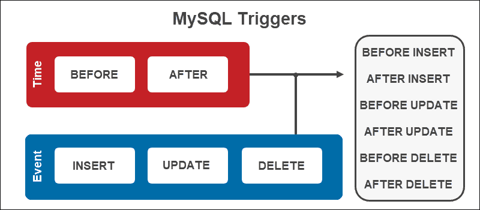

#Triggers and Events
-----------------------------------
##Triggers
A MySQL trigger is a stored program that is associated with a table. A trigger is activated before or after a defined SQL operation is performed on a table.  

### Using MySQL Triggers


### Triggers in Action 
1. **Insert data in a table**
```
-- This Trigger will check the order quantity to be inserted in the table.
DELIMITER //
CREATE TRIGGER OrderQtyCheck  
  BEFORE INSERT ON Orders  
  FOR EACH ROW  
BEGIN 
  IF NEW.Quantity < 0 THEN  
    SET NEW.Quantity = 0; 
  END IF; 
END //
DELIMITER ;
```

```
DELIMITER //
CREATE TRIGGER T1
AFTER INSERT ON Products
FOR EACH ROW
BEGIN
IF New.SellPrice < New.BuyPrice THEN
INSERT INTO Notifications (Notification, DateTime) VALUES (CONCAT('A SellPrice less than the BuyPrice was inserted for ProductID',NEW.ProductID), CURRENT_DATE());
END IF;
END //
DELIMITER ;
```

2. **Update data within a table**
```
-- This Trigger will check the new cost to be updated in the table.
DELIMITER //
CREATE TRIGGER T3
BEFORE UPDATE ON Orders
FOR EACH ROW 
BEGIN 
IF New.Cost < 0 THEN SET New.Cost = 100; END IF;
END //
DELIMITER ;
```
```
DELIMITER //
CREATE TRIGGER T2
AFTER UPDATE ON Products
FOR EACH ROW
BEGIN
IF New.SellPrice < New.BuyPrice THEN
INSERT INTO Notifications (Notification, DateTime) 
VALUES (CONCAT('ProductID No. ',OLD.ProductID, ' was updated with a SellPrice of ', NEW.SellPrice, ' which is the same or less than the BuyPrice '), CURRENT_DATE());
END IF;
END //
DELIMITER ;
```

3. **Delete data from a table**
```
-- This Trigger will update the back_up table when ever the data is deleted from the orders table.
DELIMITER //
CREATE TRIGGER T1
BEFORE DELETE ON Orders
FOR EACH ROW
BEGIN
INSERT INTO Back_up VALUES (old.OrderID, old.ClientID, old.ProductID, old.Quantity, old.Cost, old.Date);
END //
DELIMITER ;
```
### BEFORE and AFTER Triggers
1. **BEFORE** triggers are executed before the triggering event occurs. This means that the trigger code will execute before the data is changed.
**BEFORE INSERT**
```
DELIMITER //
CREATE TRIGGER Employee_bi
BEFORE INSERT ON Employee 
FOR EACH ROW
BEGIN
	IF New.Salary < 25000 THEN
	SIGNAL SQLSTATE '50001' SET MESSAGE_TEXT = 'Salary must be greater than or equal to 25000';
	END IF;
END //
DELIMITER ;
```

**BEFORE UPDATE**
```
DELIMITER //
CREATE TRIGGER Employee_bu
BEFORE UPDATE ON Employee
FOR EACH ROW
BEGIN
    IF NEW.Salary < 25000 THEN
        SIGNAL SQLSTATE '50002' SET MESSAGE_TEXT = 'Salary must be greater than or equal to 25000';
    END IF;
END //
DELIMITER ;
```

**BEFORE DELETE**
```
DELIMITER //
CREATE TRIGGER Employee_bd
BEFORE DELETE ON Employee
FOR EACH ROW
BEGIN
INSERT INTO Emp_Archieve (Name, Salary) VALUEs (OLD.Name, OLD.Salary); 
END //
DELIMITER ;
```

2. **AFTER** triggers are executed after the triggering event occurs. This means that the trigger code will execute after the data has been changed.

**AFTER INSERT**
```
DELIMITER //
CREATE TRIGGER Employee_ai
AFTER INSERT ON Employee 
FOR EACH ROW
BEGIN
	UPDATE Average_Salary SET Avg_Salary = (SELECT AVG(Salary) FROM Employee);
END //
DELIMITER ;
```

**AFTER UPDATE**
```
DELIMITER //
CREATE TRIGGER Employee_au
AFTER UPDATE ON Employee
FOR EACH ROW
BEGIN
UPDATE Average_Salary SET Avg_Salary = (SELECT AVG(Salary) FROM Employee);
END //
DELIMITER ;
```

**AFTER DELETE**
```
DELIMITER //
CREATE TRIGGER Employee_ad
AFTER DELETE ON Employee
FOR EACH ROW
BEGIN
UPDATE Average_Salary SET Avg_Salary = (SELECT AVG(Salary) FROM Employee);
END //
DELIMITER ;
```

### Types of Triggers
1. **Row-Level:** Trigger invoked for each row.
2. **Statement Level:** Trigger invoked for each statement.

### Benefit of Triggers
1. Enforcing business rules
2. Ensure data integrity (as a replacement to constraints)
3. Insert records to other tables for audit trail purposes
4. Query data for reporting purposes
5. Replicate data to different tables to achieve data consistency

### Listing all Triggers
```
SHOW TRIGGERS
[{FROM | IN} database_name]
[LIKE 'pattern' | WHERE search_condition];
```
